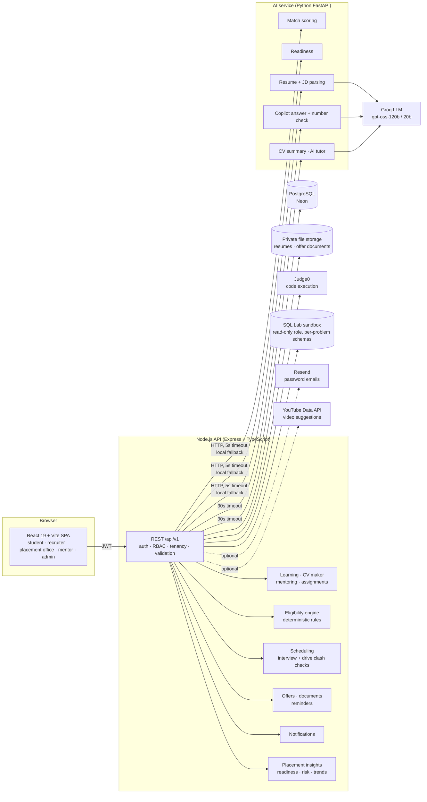

# CampusLink architecture

CampusLink is three services around one PostgreSQL database. The browser only ever talks to the Node API; the Node API is the only thing that talks to the database, the AI service, the code judge and the LLM-backed features.

## Components

| Component | Tech | Responsibility |
|---|---|---|
| Frontend | React 19, Vite 8, React Router 7, lucide icons, plain CSS design tokens (light and dark) | Five role workspaces. No business rules; renders what the API decides. |
| API | Node 24, Express, TypeScript, Prisma 5, zod, JWT, multer, pdfkit, docx | Auth, staff approval and role checks, all writes, eligibility, scheduling, offers, notifications, analytics, learning, CV export, mentoring, assignments. College and company scoping is enforced here on every query. |
| AI service | Python 3.12, FastAPI, Pydantic | Match scoring, readiness, resume/JD parsing, Copilot, CV summary, AI tutor. Stateless and side-effect free: it never touches the database. |
| Database | PostgreSQL (Neon), Prisma migrations | Single source of truth. 39 tables. |
| Code judge | Judge0 CE | Runs student code against hidden tests. Untrusted code never runs inside the API. |
| SQL sandbox | Dedicated Postgres role `sql_lab_runner` | Student queries run with a read-only role, in per-problem schemas, single `SELECT`/`WITH` only, with a statement timeout. |
| LLM | Groq (`openai/gpt-oss-120b`, falls back to `gpt-oss-20b`) | JD extraction and Copilot wording only. Every output is checked against source data before use. |

## The placement lifecycle, end to end

| Stage | What happens | Where |
|---|---|---|
| Profiling | Student adds academics, skills, projects and certifications, or uploads a PDF/DOCX/TXT resume that is parsed into them. Coding lab, SQL lab and assessments add verified skill evidence. | `students`, `coding`, `sql-lab`, `assessments` modules; AI `/ai/resume/analyze` |
| Readiness | Each open role (jobs grouped by title) is scored against the student's skill levels and banded Not Ready → Highly Employable. | `students.getReadiness`; AI `/ai/readiness` |
| Matching | Hard requirements (CGPA, branch, backlogs, required skills) are checked first; only eligible students are scored and ranked. Ineligible students see exactly which requirement blocked them. | `eligibility`, `matching`; AI `/ai/match` |
| Scheduling | Drives are checked for venue double-booking, overlapping drives that share in-process students, and plain overlaps; the next clash-free slot is suggested. Interviews are checked for student and panel double-booking. | `drives`, `interviews` |
| Notification | Shortlists, rejections, interviews (scheduled, moved, cancelled), drives (to eligible students only), offers, document requests and reviews, reminders, and at-risk nudges. | `notifications` + hooks in each module; hourly reminder job |
| Offer tracking | Offers (full-time, internship, PPO), accept / decline / defer / withdraw, internship-to-PPO conversion, document checklist with upload, verify and reject, joining status. | `offers` |
| Analytics | Funnel, placement-ready share, branch and skill conversion, package trends, recruiter engagement, offer/joining/document summaries, and a ranked list of students at risk of staying unplaced. Copilot answers questions from the same numbers. | `analytics`, `copilot` |

## Data model (main tables)

`colleges` are the tenants. `users` → one of `students` (with a college), `recruiters` (with a company) or `college_staff` (officers and mentors, with a college and an approval status); admins are users with a role. `password_reset_tokens` hold hashed single-use tokens.
Jobs are `GLOBAL` or `SELECTED_COLLEGES` (targets in `job_colleges`); `drives` belong to a college.
`students` → `student_skills`, `student_projects`, `student_certifications`, `skill_evidence`, `applications`, `offers`.
`companies` → `jobs` (with an optional auto-shortlist rule) → `job_requirements` (SKILL / CGPA / BRANCH / BACKLOG / EXPERIENCE / CERTIFICATION / MOCK_INTERVIEW).
`applications` → `interviews`. `drives` belong to a company and a job.
`offers` → `offer_documents`. `notifications` belong to a user.
Labs: `coding_problems`, `coding_submissions`, `sql_problems`, `sql_submissions`, `assessments` (MCQ or WRITTEN), `assessment_questions` (options and answer key, or rubric and word limit), `assessment_attempts` (per-answer feedback for written ones). `mock_interviews` hold staff-recorded practice interviews.
Learning: `learning_resources` (college-specific when `collegeId` is set), `learning_progress`. CV: `student_cvs` (one JSON document per student).
Mentoring: `mentor_assignments`, `escalations` (with a risk snapshot), `mentor_notes`. Assignments: `company_assignments` → `assignment_submissions`.
Audit: `analytics_events`, `audit_logs`.

## Security and privacy

- **Authentication and roles.** JWT bearer tokens; every route declares the roles allowed. A token issued before the user's last password change is rejected. Officers and mentors must be approved before any college route answers them.
- **Tenant isolation.** One helper (`utils/tenancy.ts`) resolves the caller's scope (college, company or platform) and every service builds its queries from it: officers and mentors see only their college, recruiters only their company and the students who applied to it, students only themselves and jobs open to their college. Out-of-scope records return 404.
- **Personal files are private.** Resumes, offer documents (ID proofs, marksheets) and assignment submissions are stored outside any statically served folder and are only streamed through endpoints that check who is asking. Recruiters can open a resume only after the student applies to one of their roles.
- **Untrusted code and SQL.** Code runs in Judge0, not in the API. SQL runs under a read-only database role that cannot see application tables.
- **LLM output is never trusted blindly.** JD skills must appear in the JD text; numbers must be in range; every number in a Copilot answer is checked against the data it was given and unverified figures are flagged in the UI. LLM endpoints are rate-limited per user.
- **Secrets** live only in git-ignored `.env` files.

## Deployment

Each service is a stateless process and can be containerised independently:

| Service | Suggested runtime | Scaling |
|---|---|---|
| Frontend | Static build on any CDN | n/a |
| API | Container behind a load balancer | Horizontal; no in-process state except the 30-second insights cache and the reminder timer (see below). |
| AI service | Container | Horizontal; CPU-light (the scorer does ~50,000 match scores per second). |
| Database | Managed PostgreSQL | Vertical first, read replicas for analytics. |

Changes needed before a multi-instance production rollout:

1. **Co-locate the database with the API.** Measured p50 latency today is about 2 s per heavy endpoint, dominated by ~300 ms round trips from the development machine to a Neon database in `us-east-2` (see [EVALUATION.md](EVALUATION.md#api-latency)). In the same region this drops to single-digit milliseconds per query.
2. **Move files to object storage** (S3 or compatible) and serve them through short-lived signed URLs after the same access checks.
3. **Run reminders in one place.** The hourly reminder job currently runs inside each API process; with several instances, move it to a scheduled job (cron / queue worker) or guard it with a Postgres advisory lock. Reminders are already de-duplicated per user per day, so double runs are harmless but wasteful.
4. **Share the insights cache** (Redis) or precompute insights on a schedule.
5. **Batch AI scoring.** Matching calls the AI service once per student-job pair; a batch endpoint would cut HTTP overhead for large cohorts.

## Scaling across campuses

Multi-campus tenancy is built. What exists today:

1. **Tenant key.** Students, officers, mentors (through `college_staff`) and drives carry a `collegeId`. Jobs are open to all colleges or to a chosen set.
2. **Every query is scoped** through `resolveScope` and the `*InScope` helpers in `utils/tenancy.ts`, the same way for students, applications, offers, drives, insights (cached per college) and Copilot facts. An automated check registers users at two colleges and confirms that nothing crosses over.
3. **Recruiters work across campuses.** A company posts once and chooses the audience; the candidate pool and pipeline only include students of targeted colleges.
4. **Onboarding without an operator.** A curated directory of 227 institutions, self-service "add my college" with admin verification and merge, and approval of staff by the platform admin (first officer) or the college's own officers.

Next steps:

1. **Postgres row-level security** as a second line of defence behind the service-layer scoping.
2. **University-level role** that aggregates insights across a group of colleges.
3. **Per-campus configuration.** Branch lists, readiness threshold (60 today), document checklist and reminder windows move from constants to a per-college settings table.
