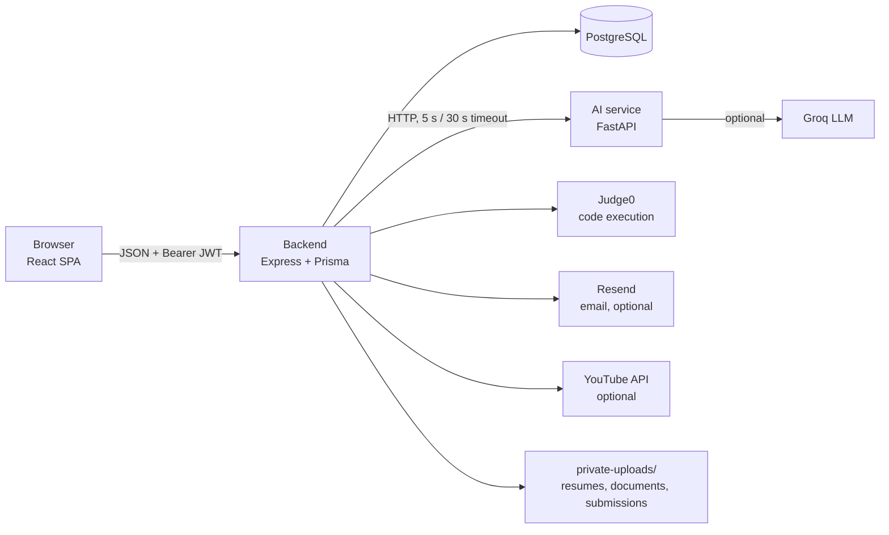

# Features and how they work

Every feature in CampusLink: what it does, who uses it, how it works step by step, the API routes behind it and the files that implement it. For who may call each route, see [RBAC.md](RBAC.md); for what every file does, see [FILES.md](FILES.md); for the scoring maths, see [ALGORITHMS.md](ALGORITHMS.md).

Paths are relative to the repo root. `BE` = `backend/src`, `FE` = `frontend/src`, `AI` = `ai-service/app`. All API routes are under `/api/v1`.

Contents

1. [Platform basics](#1-platform-basics): architecture, request flow, AI fallbacks
2. [Accounts, colleges and tenancy](#2-accounts-colleges-and-tenancy)
3. [Student profile, resume and CV maker](#3-student-profile-resume-and-cv-maker)
4. [Jobs and JD autofill](#4-jobs-and-jd-autofill)
5. [Eligibility engine](#5-eligibility-engine)
6. [Match score, candidate ranking and readiness](#6-match-score-candidate-ranking-and-readiness)
7. [Applications and the pipeline](#7-applications-and-the-pipeline)
8. [Auto-shortlisting](#8-auto-shortlisting)
9. [Interviews](#9-interviews)
10. [Placement drives and clash detection](#10-placement-drives-and-clash-detection)
11. [Offers, joining and documents](#11-offers-joining-and-documents)
12. [Company assignments](#12-company-assignments)
13. [Coding lab, SQL lab and assessments](#13-coding-lab-sql-lab-and-assessments)
14. [Mock interviews](#14-mock-interviews)
15. [Skill evidence and the skill passport](#15-skill-evidence-and-the-skill-passport)
16. [Learning, videos and the AI tutor](#16-learning-videos-and-the-ai-tutor)
17. [Mentoring, at-risk students and escalations](#17-mentoring-at-risk-students-and-escalations)
18. [Placement analytics](#18-placement-analytics)
19. [Placement Copilot](#19-placement-copilot)
20. [Predictive placement likelihood (ML)](#20-predictive-placement-likelihood-ml)
21. [Notifications, email and reminders](#21-notifications-email-and-reminders)
22. [Platform administration](#22-platform-administration)
23. [Frontend shell, design and accessibility](#23-frontend-shell-design-and-accessibility)
24. [Demo data and maintenance scripts](#24-demo-data-and-maintenance-scripts)

---

## 1. Platform basics

- **Only the backend touches the database.** The browser never calls the AI service directly.
- **Every request** goes through JWT authentication, a role check, input validation (zod) and then a service that filters by the caller's college or company. See [RBAC.md](RBAC.md#request-pipeline).
- **AI calls never break a page.** `BE/utils/ai-client.ts` returns `null` on any failure and the caller uses a fallback:

| AI feature | When the AI service or LLM is unavailable |
|---|---|
| Match score | Simple skill-overlap score, flagged "AI unavailable"; never saved as the real score and never used to shortlist |
| Readiness | Same formula computed in Node |
| Resume parsing | The upload succeeds; nothing is auto-added |
| JD analysis | Rule-based parser in the AI service; if the service is down, the form stays empty |
| CV summary | Template summary built from the CV's facts |
| Copilot, AI tutor | A plain "unavailable" message |
| Written assessment scoring | Rule-based **provisional** score if only the LLM is down; if the service is down, the attempt stays open (503) |
| Predictive model | Panel says "unavailable" |

- **Response format:** `{ data }`, `{ data, pagination }` or `{ success: false, error: { code, message, ... } }`. Lists are paginated with `?page=&limit=` (default 20, maximum 100).

---

## 2. Accounts, colleges and tenancy

**Who:** everyone. **Screens:** `/signup`, `/login`, `/forgot-password`, `/reset-password`, the pending-approval screen.

**Sign-up** (`POST /auth/register`)
1. The user picks a role: Student, Recruiter, Placement office or Mentor. Admin can't be chosen.
2. Students, officers and mentors choose a college from the searchable directory (`GET /colleges?q=`: 227 preloaded institutions, prefix matches ranked first). If it's missing they add it (name, city, state); it's usable immediately and marked unverified.
3. Recruiters type a company name; the company is created, or joined if it exists.
4. Students pick their branch code (CSE, IT, ECE, EEE, ME, Civil, MCA), so branch eligibility never fails on free text.
5. The password must be 8+ characters with a letter and a number (`FE/lib/password.js` mirrors the backend rule).
6. Officers and mentors are created **PENDING**. The college's approved officers are notified, or the platform admins if the college has none yet. Until approved, the frontend shows "Waiting for approval" and the backend refuses every college route.

**Login** returns a 7-day JWT stored in `localStorage`. On page load `GET /auth/me` restores the session.

**Forgot / reset password**
- `POST /auth/forgot-password` creates a random single-use token (only its SHA-256 hash is stored), valid 30 minutes, and emails the link (or prints it in the API log without Resend). The response is identical whether or not the account exists.
- `POST /auth/reset-password` sets the new password and `passwordChangedAt`, which invalidates every older token (signed out everywhere), then sends a confirmation email.
- Sign-up, login and reset are rate-limited per IP; forgot-password also per email.

**Tenancy:** the college is the tenant. See [RBAC.md](RBAC.md#scope-resolution).

**Files:** `BE/modules/auth/*`, `BE/modules/colleges/*`, `BE/utils/{jwt,session,password,tenancy}.ts`, `FE/context/AuthContext.jsx`, `FE/pages/auth/*`, `FE/components/common/{ProtectedRoute,PendingApproval,CollegePicker}.jsx`.

---

## 3. Student profile, resume and CV maker

**Who:** students. **Screens:** `/student/profile`, `/student/cv`.

**Profile** (`GET/PUT /students/me`)
- Branch, CGPA, graduation year, active backlogs, phone.
- Skills with self-rated levels 1–5 (`POST /students/me/skills`). Skill names are normalised, so "java" and "Java " are the same skill (`BE/modules/skills/skills.service.ts`).
- Projects (title, technologies, link, description) and certifications (name, issuer, date, link).
- **Profile completeness** is six checks: branch, CGPA + graduation year, phone, resume, at least 3 skills, at least 1 project. The dashboard's "Next steps" list uses the same six checks.

**Resume upload** (`POST /students/me/resume`, PDF, DOCX or TXT up to 10 MB)
1. The file is saved to `backend/private-uploads/resumes/` (never served statically).
2. Text is extracted (`BE/utils/resume-text.ts`: unpdf for PDF, mammoth for DOCX).
3. The AI service parses it (`POST /ai/resume/analyze`: dictionary and regex, no LLM) into skills, projects, certifications and education.
4. Only **new** items are added: skills at level 2 with source "resume", new projects and certifications. Existing levels are never overwritten. The student is told exactly what was added.

**CV maker** (`/cv/me*`)
1. `GET /cv/me/prefill` builds a first draft from the profile: education, skills (verified first), projects with descriptions split into bullets, certifications and verified assessment scores as achievements.
2. The student edits every section beside a live preview (`FE/components/cv/CvPreview.jsx`).
3. **Draft with AI** (`POST /cv/me/suggest-summary`) writes a 2–3 sentence summary from the CV's own facts only. Without an LLM it builds a template summary.
4. **Download** as PDF (pdfkit) or Word (docx) in the Classic or Modern template (`GET /cv/me/export/pdf|docx`). Both are text-based, so applicant-tracking systems can read them.
5. **Use as my resume** (`POST /cv/me/save-as-resume`) renders the PDF, saves it as the resume and adds any new skills, projects and certifications to the profile.

**Files:** `BE/modules/students/*`, `BE/modules/cv/{cv.service,cv.render,cv.schema,cv.routes}.ts`, `AI/api/resume.py`, `AI/logic/extraction.py`, `AI/api/cv.py`, `FE/pages/student/{StudentProfile,CvMaker}.jsx`, `FE/components/student/ProfileExtras.jsx`.

---

## 4. Jobs and JD autofill

**Who:** recruiters (any college or selected ones), placement officers (own college only), admins. **Screen:** Recruiter → Jobs → Post a job.

**Posting a job** (`POST /jobs`)
- Role, location, type (full-time, internship, contract), salary in LPA, application deadline.
- **Audience:** *All colleges* (GLOBAL) or *Selected colleges* (a list). A job for selected colleges is invisible everywhere else. Officers' jobs are always limited to their own college.
- **Requirements**, stored as typed rows in `job_requirements`:
  - minimum CGPA, maximum active backlogs, eligible branches
  - an optional **minimum mock-interview score** (required or preferred)
  - skills with a minimum level (1–5), each **required** (blocks eligibility) or **preferred** (affects score only)
- An optional **auto-shortlist rule** (see [§8](#8-auto-shortlisting)).
- Skills are found or created in one batch, and duplicates within a posting are removed.

**JD autofill** (`POST /ai/jobs/analyze`)
1. The recruiter pastes a job description.
2. The AI service runs the rule-based parser first, then (with a Groq key) the LLM.
3. **Grounding:** a skill the LLM returns is kept only if it appears in the JD text or the skill dictionary; CGPA and experience numbers must appear in the text and be in range. Dictionary skills the LLM missed are added back.
4. The form is pre-filled and the filled fields flash so the recruiter reviews them.

**Editing** (`PUT /jobs/:id`): the owner only. Changing the auto-shortlist rule or publishing re-runs it in the background.

**Files:** `BE/modules/jobs/*`, `BE/modules/ai/ai.routes.ts`, `AI/api/jd.py`, `AI/logic/{jd_llm,extraction}.py`, `AI/skills/dictionary.py`, `FE/components/recruiter/{JobForm,JdAutofill}.jsx`, `FE/pages/recruiter/RecruiterDashboard.jsx`.

---

## 5. Eligibility engine

A pure function with no database access (`BE/modules/eligibility/eligibility.service.ts`), used everywhere a decision is made: job matches, applying, candidate pools, drive announcements, readiness, insights and the predictive model.

| Requirement | Passes when |
|---|---|
| CGPA | student CGPA ≥ minimum |
| BRANCH | list empty, or the student's branch code is in it (case-insensitive) |
| BACKLOG | active backlogs ≤ limit |
| SKILL (required) | the student has the skill at ≥ the minimum level |
| SKILL (preferred) | never blocks; reported only |
| EXPERIENCE | months ≥ minimum |
| MOCK_INTERVIEW | latest mock-interview score ≥ benchmark; no score fails a required benchmark |
| CERTIFICATION | always passes (not verified yet) |

Only **required** failures block. Every check returns a sentence with the real values ("Your CGPA (6.4) is below the 7 minimum", "Kubernetes is at level 2; the role needs level 3"). `explainEligibility` combines them into one verdict, e.g. *"Not eligible: your CGPA meets the criteria, but your mock-interview score (5.5/10) is below the 7/10 benchmark and the role requires Kubernetes, which isn't on your profile."*

Where it shows: the student's **Job matches** (Eligible / Not eligible yet tabs with a requirement-by-requirement checklist), the `400 NOT_ELIGIBLE` response when applying, and the recruiter's **screening summary** ("Missing AWS · 6").

**Tests:** `backend/tests/eligibility.test.ts`, `mock-interview.test.ts`.

---

## 6. Match score, candidate ranking and readiness

**Match score** (`POST /ai/match`, `AI/logic/scoring.py`): an explainable weighted formula over sub-scores from 0 to 100.

| Sub-score | Weight | How |
|---|---|---|
| Skills | 40% | Full credit per required skill at or above the level, partial below, zero if missing |
| Academics | 20% | CGPA against the role's minimum |
| Projects | 10% | Overlap between required skills and project technologies |
| Certifications | 10% | 30 per verified certification, capped at 100 |
| Assessments | 10% | A proxy for now: the average level on the required skills (50 if the student has none of them) |
| Experience | 10% | Months / 12 |

It returns the overall score, the breakdown, matched and missing skills and explanation lines. Only **eligible** students are scored; a score never overrides eligibility.

**Student view** (`GET /matching/student/me/jobs`): every open job visible to their college, scored, with matched skills, skills to learn and the breakdown.

**Recruiter view** (`GET /matching/job/:jobId/candidates`, screen `/recruiter/jobs/:id/candidates`)
1. **Pool:** every college for a GLOBAL job, the target colleges for a restricted one; officers only see their own college.
2. **Eligibility** filters the pool; excluded students are counted per failing requirement (the screening summary).
3. Eligible students are scored and ranked. Each card says *why* it ranks there ("Strong on skills, academics. Ranked above Neha mainly on projects") and shows the breakdown.
4. **Recalculate** (`POST /matching/job/:jobId`) re-scores, saves the score onto existing applications (never a fallback score) and runs the auto-shortlist rule.

**Readiness by role** (`GET /students/me/readiness`, `AI/logic/readiness.py`): the average of `level / 5` over a role's required skills, 0–100, in bands: **Not Ready** (< 40), **Developing** (40–59), **Ready** (60–79), **Highly Employable** (80+). Shown on the student dashboard and aggregated on the office overview.

**Skill gap** (`GET /students/me/skill-gaps?jobId=`, `/student/skill-gap`): matched vs missing skills for any role, including ones the student isn't eligible for yet, with links to labs, assessments and learning material.

**Files:** `BE/modules/matching/*`, `BE/modules/students/students.service.ts` (readiness, gaps), `AI/api/{matching,readiness,skills}.py`, `FE/pages/student/{JobRecommendations,StudentSkillGap}.jsx`, `FE/pages/recruiter/JobCandidates.jsx`, `FE/components/common/{MatchScore,ScoreBreakdown}.jsx`.

---

## 7. Applications and the pipeline

**Applying** (`POST /applications`)
1. The job must be visible to the student's college and published; one application per job.
2. The eligibility engine must pass, otherwise `400 NOT_ELIGIBLE` with the reasons.
3. The application is created as **Eligible**, the recruiters are notified, and the auto-shortlist rule runs if it's on.

**Stages:** Applied → Eligible → Shortlisted → Assessment → Interview → Selected → Offered → Accepted → Joined, plus Rejected and Declined. Forward moves are allowed; Rejected or Declined can be set from any stage that isn't final; Joined, Rejected and Declined are final (`isValidStatusTransition`, mirrored in `FE/components/pipeline/pipelineConfig.js`).

**Pipeline board** (`/recruiter/pipeline`, `/placement/pipeline`)
- A drag-and-drop Kanban. Moves that aren't allowed are refused instantly, and moves that need details open a form (schedule interview, make offer).
- Card actions per stage: shortlist, schedule interview, send assignment, add round, select, make offer, mark joined / did not join, reject (with confirmation).
- Cards show match score, resume download, interview time, assignment status or score, offer status and an **Auto-shortlisted** tag.
- Moving a card (`PATCH /applications/:id`) notifies the student on shortlist, selection and rejection.

**Files:** `BE/modules/applications/*`, `FE/pages/shared/ApplicationsPipeline.jsx`, `FE/components/pipeline/*`, `FE/pages/student/StudentApplications.jsx`.

---

## 8. Auto-shortlisting

**Who sets it:** the recruiter, per job (job form or candidates page). **Rule:** "shortlist eligible applicants whose match score is at least *T*" (default 70).

**How it runs** (`BE/modules/applications/auto-shortlist.ts → runAutoShortlist`)
1. Triggered when a student applies, when the rule is switched on or its threshold changes, when the job is published, and on **Recalculate**.
2. Only acts on published jobs with the rule on, and only on applications still at Applied/Eligible, so it never overrides a person's decision.
3. Scores missing match scores; skips any fallback score (AI unavailable).
4. Moves qualifying applications with a conditional update (so concurrent runs can't double-notify), stamps `autoShortlistedAt` and logs an `AUTO_SHORTLISTED` event.
5. Tells each student why: *"Your match score of 78 meets Kaveri FinTech's shortlisting threshold of 70."* Recruiters get a count.

---

## 9. Interviews

**Who schedules:** recruiters and officers. **Screens:** pipeline card → Schedule interview, `/recruiter/interviews`, `/placement/interviews`, `/student/interviews`.

1. `POST /interviews` with round, time, duration, venue, panel and meeting link.
2. **Clash check:** the student or the panel already has a scheduled interview overlapping that time → `409 INTERVIEW_CONFLICT` with the next free slot, offered as one click.
3. The application moves to **Interview** and the student is notified (also by email).
4. `PATCH /interviews/:id`: reschedule, cancel, or record the outcome (attended with a 0–10 score and feedback, or no-show). The student is notified of changes.
5. The agenda is grouped by day; students see upcoming and past interviews.

**Files:** `BE/modules/interviews/*`, `FE/components/pipeline/ScheduleInterviewModal.jsx`, `FE/pages/shared/InterviewsManager.jsx`, `FE/pages/student/StudentInterviews.jsx`.

---

## 10. Placement drives and clash detection

**Who:** placement officers (own college) and admins; recruiters see their company's drives. **Screen:** `/placement/drives`.

1. The officer fills company, role, start time, duration, venue, capacity and registration deadline.
2. **Live clash check** while typing (`POST /drives/check`, `BE/modules/drives/drive-conflicts.ts`):
   - **same venue at an overlapping time**: blocked (`409 DRIVE_CONFLICT`)
   - **overlapping drives that share students in process**: warning, with names
   - plain overlap: note
   - the next clash-free slot (09:00–18:00, 30-minute steps, 14 days) is offered as one click
3. Creating the drive (`POST /drives`) notifies the college's **eligible** students and the company's recruiters.
4. **Check an existing drive** (`GET /drives/:id/conflicts`) also reports interviews that double-book a student or a panel.

A property test compares the detector with a minute-by-minute brute force on 500 random schedules (`backend/tests/drive-conflicts.test.ts`).

**Files:** `BE/modules/drives/*`, `FE/pages/placement/PlacementDrives.jsx`.

---

## 11. Offers, joining and documents

**Who:** recruiters and officers make and manage offers; students respond and upload documents. **Screens:** pipeline card → Make offer, `/recruiter/offers`, `/placement/offers`, `/student/offers`.

**Making an offer** (`POST /offers`; the application must be **Selected**)
- Full-time, internship or pre-placement offer (PPO); CTC or stipend, role, location, joining date, bond.
- A document checklist is created: offer letter (employer), signed acceptance, ID proof and marksheets (student, due in 7 days), plus bond agreement if there's a bond.
- The application moves to **Offered** and the student is notified.

**Student response** (`POST /offers/:id/respond`): accept, decline, or **ask for more time** once, with a decide-by date and a note. The application follows (Accepted / Declined), and recruiters and officers are notified.

**Employer actions**
- **Withdraw** with a reason (not after joining); the student sees the reason.
- **Internship outcome**: convert an accepted internship to a PPO (creates a separate PPO offer with its own documents) or record no conversion.
- **Joining**: mark joined or did not join on accepted offers; the application follows.

**Documents**
- Students upload student-owned documents (PDF or image, 10 MB) → **Submitted**, and reviewers are notified.
- Recruiters upload the offer letter → **Verified**, and the student is notified.
- Reviewers **verify** or **send back with a note**; they can request extra documents with a due date.
- Files live in `backend/private-uploads/offer-documents/` and are streamed only after an access check.

**Reminders** (hourly, `BE/modules/offers/offer-reminders.ts`): documents due within 2 days or overdue → the student; offers unanswered for 3+ days → recruiters and officers. Never repeated to the same person within a day.

**Files:** `BE/modules/offers/*`, `FE/pages/shared/OffersManager.jsx`, `FE/pages/student/StudentOffers.jsx`, `FE/components/offers/OfferDocuments.jsx`, `FE/components/pipeline/MakeOfferModal.jsx`.

---

## 12. Company assignments

**Who:** recruiters create and review; students submit. **Screens:** `/recruiter/assignments`, `/recruiter/assignments/:id`, `/student/assignments`.

1. The recruiter creates a take-home task for one of their jobs: title, instructions, due date (in the future) and maximum score (`POST /assignments`).
2. Candidates are chosen: all, shortlisted only, or hand-picked. They must have applied and be between Applied and Interview. Their applications move to **Assessment** and they're notified.
3. The student submits a written answer, a link and/or a file (15 MB, private storage), and can resubmit until the due date or until it's reviewed.
4. The recruiter sees submitted/reviewed counts and the average, opens each submission, and **scores it with feedback** (capped at the maximum). The student is notified.
5. More candidates can be added; the assignment can be closed and reopened.

Assignments are free-form and scored by hand. Coding and SQL problems can't yet be attached to an assignment.

**Files:** `BE/modules/assignments/*`, `FE/pages/recruiter/{RecruiterAssignments,AssignmentDetail}.jsx`, `FE/pages/student/StudentAssignments.jsx`, `FE/components/assignments/CandidateChecklist.jsx`.

---

## 13. Coding lab, SQL lab and assessments

**Who:** students practise; placement officers and admins create content through the API (`POST /coding/problems`, `/sql/problems`, `/assessments`; there's no authoring screen).

**Coding lab** (`/student/code-lab`)
- Monaco editor in JavaScript, Python, Java or C++.
- **Run** executes the visible examples on Judge0; **Submit** runs visible and hidden tests. Hidden tests are never sent to the browser.
- Passing every test records verified evidence for the problem's skill.

**SQL lab** (`/student/sql-lab`)
- Each problem has its own schema (`sql_lab_p_<id>`) with sample data.
- Queries run under a separate **read-only database role** (`sql_lab_runner`) that can't see application tables, limited to one `SELECT`/`WITH` statement with a 5-second timeout (`BE/utils/sql-guard.ts`).
- Output is compared with the solution's rows (order-insensitive); passing records evidence.

**Assessments** (`/student/assessments`)
- Timed: a sticky timer, answered-count progress, auto-submit at zero, and a warning before submitting with unanswered questions.
- **Multiple choice** (e.g. quantitative aptitude): marked against the answer key, which is never sent to the browser.
- **Written** (e.g. professional communication):
  1. The student writes free-text answers with a live word count.
  2. The AI service scores each answer 0–10 on **clarity, structure, grammar and relevance** against the question's rubric, with feedback. Answers are passed to the model as data, never as instructions.
  3. If the LLM is unavailable, a rule-based check gives a **provisional** score (capped at 7 per criterion) that never verifies a skill.
  4. If the AI service is unreachable, the submission is refused with `503 SCORING_UNAVAILABLE` and the attempt stays open.
- Passing (percentage ≥ pass mark) records verified evidence for the assessment's skill.

**Files:** `BE/modules/{coding,sql-lab,assessments}/*`, `BE/utils/{judge0-client,sql-guard}.ts`, `BE/config/sql-lab-prisma.ts`, `AI/api/written.py`, `FE/pages/student/{CodeLab*,SqlLab*,Assessment*}.jsx`.

---

## 14. Mock interviews

**Who:** placement officers and mentors record; students view. **Screens:** `/placement/mock-interviews`, `/mentor/mock-interviews`, mentee page → Record, `/student/mock-interviews`, the student dashboard card.

1. Staff record a practice interview for a student at their college (`POST /mock-interviews`): four scores 0–10 (technical knowledge, communication, problem solving, confidence), an optional skill tested, focus and feedback.
2. The **overall score** is the mean of the four, to one decimal.
3. **Evidence:** communication ≥ 6 verifies "Communication"; technical ≥ 6 with a named skill verifies that skill. This raises readiness and match scores the same way a lab does.
4. The student is notified and sees every round with the scores, feedback and change since last time.
5. The **latest** score feeds the MOCK_INTERVIEW eligibility benchmark and the at-risk score (below 5 adds 10 points; no mock interview isn't penalised).
6. The staff page summarises students assessed, average latest score, how many are below 5 and how many haven't had one.

**Files:** `BE/modules/mock-interviews/*`, `FE/pages/shared/MockInterviewsManager.jsx`, `FE/pages/student/StudentMockInterviews.jsx`, `FE/components/mock-interviews/*`.

---

## 15. Skill evidence and the skill passport

`BE/modules/skill-evidence/skill-evidence.service.ts → recordSkillEvidence` is the single place a skill becomes **verified**:

| Source | When |
|---|---|
| Coding lab | all tests pass |
| SQL lab | output matches |
| Assessment | passed (MCQ, or written scored by the LLM) |
| Mock interview | sub-score ≥ 6 |

It writes a `skill_evidence` row (source, score, date) and marks the student's skill verified at level ≥ 3. The **Skill passport** (`/student/skill-passport`, `GET /students/me/skill-passport`) lists every skill with its level, verified badge and the evidence behind it. Verified skills count in match scores, readiness and the predictive model's `verified_ratio`.

---

## 16. Learning, videos and the AI tutor

**Who:** students learn; officers and mentors add college material; admins add shared material. **Screens:** `/student/learning`, `/student/tutor`, skill-gap page tabs, `/placement/learning`, `/mentor/learning`, `/admin/learning`.

- **Improve my match** (`GET /learning/plan`): the skills open roles ask for that the student lacks or has below the required level, ranked by how many roles need them, each with the roles, library material and progress.
- **Library** (`GET /learning/resources`): 39 curated free resources across 25+ skills plus the college's own; search and filter by type. Students track items as Saved, Started or Done (`PUT /learning/resources/:id/progress`).
- **Video suggestions** (`GET /learning/videos?skill=&mode=learn|improve`): with `YOUTUBE_API_KEY`, real videos cached 12 hours per skill; otherwise ready-made YouTube searches.
- **AI tutor** (`POST /learning/tutor`):
  1. A chat for any topic or one skill, with starter prompts.
  2. The backend sends the question, recent history and the student's visible library items.
  3. The tutor may recommend and cite **only** those items; unknown IDs are dropped.
  4. For company assignments it explains concepts and approach but won't write the solution.
  5. Rate-limited per student.
- **College material** (`POST /learning/resources`): staff add items for their college; admins add items shared with every college. Only the owning college (or an admin) can remove them.

**Files:** `BE/modules/learning/*`, `BE/utils/youtube.ts`, `AI/api/tutor.py`, `FE/pages/student/{LearningPage,TutorPage}.jsx`, `FE/pages/shared/LearningLibrary.jsx`, `FE/components/learning/*`.

---

## 17. Mentoring, at-risk students and escalations

**Who:** placement officers run it; mentors act on their mentees. **Screens:** `/placement/mentoring`, `/mentor/*`.

**At-risk score** (`BE/modules/analytics/risk.ts`): for each student without an accepted offer, points per factor:

| Factor | Points |
|---|---|
| Hasn't applied to any role | 25 |
| Not eligible for any open role (only one: 10) | 25 |
| Best role readiness < 40 (40–59: 10) | 20 |
| Rejected from 2+ applications | 10 |
| Missed an interview | 10 |
| Active backlogs | 10 |
| Profile less than 60% complete | 10 |
| Latest mock-interview score below 5 | 10 |
| No verified skills | 5 |

50+ is **High**, 25–49 **Medium**. Every flagged student shows the reasons.

**Workflow**
1. The office sees the at-risk queue (`GET /mentoring/at-risk`) and can **nudge** a student (sends the reasons with next steps) from the overview.
2. **Assign a mentor** (`POST /mentoring/assignments`; must be an approved mentor of the same college). Mentor and student are notified; the student sees their mentor on the dashboard.
3. **Escalate** (`POST /mentoring/escalations`) with a note. It keeps a snapshot of the risk score and factors; one open escalation per student; the mentor is notified.
4. The mentor sees a dashboard (mentees, at risk, open escalations, follow-ups due, placed), a mentee table and each **student page** (profile, applications, offers, learning, mock interviews, risk reasons).
5. **Notes with follow-up dates** are shared between the mentor and the office.
6. The mentor starts work on an escalation, then **resolves it with a note**; the office is notified.

**Files:** `BE/modules/mentoring/*`, `BE/modules/analytics/{risk,insights.service}.ts`, `FE/pages/placement/PlacementMentoring.jsx`, `FE/pages/mentor/*`, `FE/components/mentoring/EscalationList.jsx`.

---

## 18. Placement analytics

**Who:** placement officers (own college), admins (platform). **Screen:** `/placement/dashboard` (`GET /analytics/insights`, cached 30 seconds per college).

- **Headline:** students, placed, placement rate, share placement-ready (readiness 60+ for at least one role), offers by status, upcoming drives.
- **At-risk students** with reasons and a one-click nudge.
- **Funnel** from applied to joined with stage-to-stage conversion (`GET /analytics/funnel`).
- **Branch-wise conversion:** students, applied, placed and rate per branch.
- **Skills in demand:** roles needing each skill, students who have it, and their placement rate (labelled an observed pattern, not cause).
- **Readiness by role:** students in each band for every open role.
- **Packages:** average, median and highest CTC; by company; monthly trend.
- **Recruiter engagement:** open roles, drives, applications, offers, accepted, joined, last activity, Active/Idle, repeat hirer.
- **Offers, joining and documents:** awaiting reply, deferred, declined, withdrawn, PPOs, joined, pending, documents to review, missing, overdue, verified.

Recruiters get a company dashboard from `GET /analytics/overview` and `/analytics/funnel`.

**Files:** `BE/modules/analytics/*`, `FE/pages/placement/PlacementDashboard.jsx`, `FE/components/common/FunnelBars.jsx`.

---

## 19. Placement Copilot

**Who:** officers (own college), recruiters (own company), admins (platform). **Screens:** `/placement/copilot`, `/recruiter/copilot`.

1. The user asks a plain-English question (`POST /copilot/query`).
2. The backend builds a **fresh facts snapshot scoped to the caller** (`BE/modules/copilot/copilot.service.ts → buildFacts`): funnel, conversion, skill supply vs demand, departments, companies, offers and documents, drives and clashes, top applicants, learning and mentoring figures (officers), assignments (recruiters), definitions and what isn't tracked.
3. The LLM answers **only from those facts** and treats them as data, not instructions.
4. **Verification:** every number in the answer is checked (±0.5) against the facts and the question; untraceable numbers are flagged in the UI.
5. **Show data used** reveals the snapshot. Rate-limited per user; a busy LLM is reported plainly.

**Files:** `BE/modules/copilot/*`, `AI/api/copilot.py`, `AI/logic/copilot.py`, `FE/pages/shared/CopilotPage.jsx`.

---

## 20. Predictive placement likelihood (ML)

A separate, additive model that **never** affects eligibility, the match score or ranking.

- **Model:** logistic regression over 7 features: the match engine's six sub-scores plus `verified_ratio` (share of required skills the student has verified).
- **Trained** on 6 simulated placement seasons (~13,000 eligible pairs), **evaluated** on 2 unseen seasons: AUC 0.951 vs the hand-set formula's 0.941.
- **Serving:** `AI/ml/serve.py` loads `model.json` and computes the sigmoid by hand (no scikit-learn at runtime).
- **UI:** a collapsed "Predictive likelihood (experimental)" panel under the ranked candidates (`GET /predictive/jobs/:jobId/candidates`), with the model's weights and evaluation on request (`GET /predictive/model-info`).
- If the model file is missing, every call returns "unavailable".
- Retrain: `cd ai-service && pip install -r requirements-train.txt && python -m app.ml.train`.

**Files:** `AI/ml/*`, `AI/api/predictive.py`, `BE/modules/predictive/*`, `BE/utils/ml-client.ts`, `FE/components/recruiter/PredictiveLikelihoodPanel.jsx`. Details in [ALGORITHMS.md §2a](ALGORITHMS.md#2a-predictive-placement-likelihood-separate-additive) and [EVALUATION.md §1a](EVALUATION.md#1a-predictive-model-vs-the-hand-set-formula-held-out-seasons).

---

## 21. Notifications, email and reminders

- **In-app** (`BE/modules/notifications/notifications.service.ts → notify`): a row per recipient with type, title, body and a link to the relevant page. The bell polls the unread count every 30 seconds and on window focus; mark one or all as read (`/notifications*`).
- **Sent for:** new applicants; shortlisted, selected, rejected, auto-shortlisted; interview scheduled, rescheduled, cancelled; drive announced; offer received, response, withdrawn, internship converted; document requested, uploaded, verified or sent back; document due or overdue; offer follow-ups; at-risk nudges; staff requests and decisions; mentor assigned; escalations and resolutions; assignments received, submitted and reviewed; mock interviews recorded.
- **Email** (Resend) for shortlists, selections, rejections, interviews, offers, withdrawals, follow-ups, documents and deadline reminders, drives, assignments, mock interviews, nudges, escalations and staff decisions. Requirements:
  - `RESEND_API_KEY` must be set.
  - `EMAIL_NOTIFICATIONS=off` disables it.
  - Demo accounts (`@demo.campuslink.dev`) are never emailed.
  - Sending is best-effort and never blocks the request.
- **Reminders:** the hourly job in [§11](#11-offers-joining-and-documents), de-duplicated per person per day.

**Files:** `BE/modules/notifications/*`, `BE/utils/email.ts`, `FE/components/layout/Notifications.jsx`.

---

## 22. Platform administration

**Who:** admins (created only with `scripts/create-admin.ts`). **Screens:** `/admin/*` plus the platform-wide dashboard, students, companies, offers and Copilot.

- **Staff approvals** across all colleges, flagged when the request is a college's first officer or comes from an unverified college.
- **New colleges:** verify, correct, or **merge** a duplicate into the right entry. Merging moves its students, staff, drives, job targets and learning resources, then deletes the duplicate.
- **Shared learning library:** items added here are visible to every college.

**Files:** `BE/modules/colleges/*`, `FE/pages/admin/*`, `FE/components/staff/StaffRequests.jsx`.

---

## 23. Frontend shell, design and accessibility

- **Routing** (`FE/App.jsx`): five workspaces behind `ProtectedRoute`, each with its own sidebar (`FE/components/layout/navigation.js`).
- **App shell** (`FE/components/layout/AppShell.jsx`): sidebar with sections, notification bell, user card, theme toggle and log out; on phones it becomes a slide-out menu.
- **Design system:** plain CSS with tokens (`FE/styles/tokens.css`), IBM Plex Sans and Mono, one blue accent, colour reserved for status. Light and dark themes follow the OS until the user picks one.
- **Responsive** from phone to desktop: modals become bottom sheets, tables scroll inside their cards.
- **Accessible:** keyboard focus rings, labelled controls, screen-reader text for icon buttons, reduced-motion support.
- **Landing page** (`FE/pages/LandingPage.jsx`): product overview with workspace previews and campus photos (credited).

---

## 24. Demo data and maintenance scripts

`npx tsx scripts/seed-demo.ts` (from `backend/`, with the AI service running) loads a full season: 46 students across two colleges and five branches, recruiters for every company, 4 extra jobs, applications at every stage with interviews and offers, 5 upcoming drives, mock interviews, aptitude results, a written communication assessment, mentor assignments and escalations. It's deterministic and re-runnable (it deletes only what it created). Demo password: `Demo@2026`. Logins are listed in the [README](../README.md#demo-walkthrough).

The other scripts (college directory, learning library, admin creation, SQL-lab role, data fixes) are described in [FILES.md](FILES.md#backendscripts).
