# Access control (RBAC and tenancy)

How CampusLink decides who can do what. There are three layers, and every request passes through all of them:

1. **Authentication**: a valid, current JWT (`middleware/auth.ts → requireAuth`).
2. **Role check**: the route lists the roles allowed (`requireRole(...)`). A wrong role gets **403 FORBIDDEN** before any database work.
3. **Scope check** (tenancy): the service resolves *which* records the caller may touch: their college, their company, or only themselves (`utils/tenancy.ts → resolveScope`). Out-of-scope records usually return **404**, so their existence isn't revealed; some modules return 403 (see [Known gaps](#known-gaps-and-inconsistencies)).

The frontend mirrors layer 2 so users only see the screens their role can use, but **the backend is the only enforcement point**. Every rule below is checked server-side.

Contents: [Roles](#roles) · [Request pipeline](#request-pipeline) · [Scope resolution](#scope-resolution) · [Frontend guards](#frontend-guards) · [Permission matrix](#permission-matrix) · [Feature flows](#feature-flows) · [Rate limits](#rate-limits) · [Known gaps](#known-gaps-and-inconsistencies)

---

## Roles

| Role | Belongs to | How the account is created | Sees |
|---|---|---|---|
| `STUDENT` | one college | Sign-up (picks college and branch) | Only their own data, and jobs open to their college |
| `RECRUITER` | one company | Sign-up (types a company name; the company is created or joined) | Their company's jobs, and only students who applied to them |
| `PLACEMENT_OFFICER` | one college | Sign-up, then **approved** (first officer of a college by a platform admin, later ones by the college's officers) | Everything at their college |
| `MENTOR` | one college | Sign-up, then approved by the college's placement office | Their college's students; can act only on assigned or escalated mentees |
| `ADMIN` | the platform | Command line only: `scripts/create-admin.ts` | Everything, across colleges |

**Staff approval.** Officers and mentors start as `PENDING` in `college_staff`. Until an approver sets them to `APPROVED`, every college-scoped endpoint refuses them with **403 `APPROVAL_PENDING`** (or `APPROVAL_REJECTED`), and the frontend shows a "Waiting for approval" screen instead of the workspace.

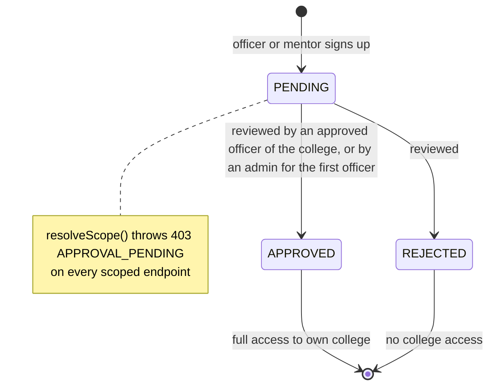
```mermaid
stateDiagram-v2
    [*] --> PENDING: officer or mentor signs up
    PENDING --> APPROVED: reviewed by an approved officer of the college, or by an admin for the first officer
    PENDING --> REJECTED: reviewed
    APPROVED --> [*]: full access to own college
    REJECTED --> [*]: no college access
    note right of PENDING
        resolveScope() throws 403 APPROVAL_PENDING
        on every scoped endpoint
    end note
```

---

## Request pipeline

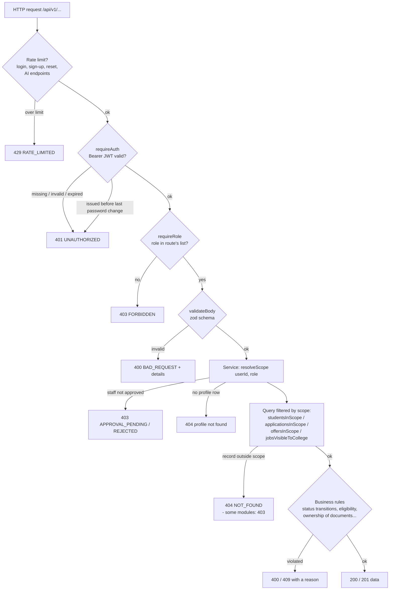
```mermaid
flowchart TD
    A[HTTP request /api/v1/...] --> RL{Rate limit?<br/>login, sign-up, reset,<br/>AI endpoints}
    RL -- over limit --> R429[429 RATE_LIMITED]
    RL -- ok --> AU{requireAuth<br/>Bearer JWT valid?}
    AU -- missing / invalid / expired --> R401[401 UNAUTHORIZED]
    AU -- issued before last password change --> R401
    AU -- ok --> RO{requireRole<br/>role in route's list?}
    RO -- no --> R403[403 FORBIDDEN]
    RO -- yes --> VA{validateBody<br/>zod schema}
    VA -- invalid --> R400[400 BAD_REQUEST + details]
    VA -- ok --> SC[Service: resolveScope userId, role]
    SC -- staff not approved --> R403b[403 APPROVAL_PENDING / REJECTED]
    SC -- no profile row --> R404p[404 profile not found]
    SC --> Q[Query filtered by scope:<br/>studentsInScope / applicationsInScope /<br/>offersInScope / jobsVisibleToCollege]
    Q -- record outside scope --> R404[404 NOT_FOUND<br/>- some modules: 403]
    Q -- ok --> BR{Business rules<br/>status transitions, eligibility,<br/>ownership of documents...}
    BR -- violated --> R4xx[400 / 409 with a reason]
    BR -- ok --> OK[200 / 201 data]
```

Details:

- **JWT** (`utils/jwt.ts`): HS256 with `JWT_SECRET`, 7-day expiry, payload `{ userId, role, iat }`. The frontend stores it in `localStorage["campuslink_token"]` and sends it as `Authorization: Bearer ...`.
- **Session revocation** (`utils/session.ts`): resetting a password sets `users.passwordChangedAt`; any token issued before that moment gets 401. The timestamp is cached per user for 60 seconds.
- **Role check** (`requireRole`): a pure role list, no database lookup.
- **Errors** (`middleware/errorHandler.ts`): `{ success: false, error: { code, message, ... } }`.

---

## Scope resolution

`resolveScope(userId, role)` in `backend/src/utils/tenancy.ts` returns `{ userId, role, collegeId, companyId, isAdmin }`. Every service builds its Prisma `where` from it.

| Role | `resolveScope` result | Failure |
|---|---|---|
| ADMIN | `isAdmin: true`, no college or company | none (no lookup) |
| STUDENT | `collegeId` = the student's college | 404 if the Student row is missing |
| RECRUITER | `companyId` = the recruiter's company | 404 if the Recruiter row is missing |
| PLACEMENT_OFFICER, MENTOR | `collegeId` from `college_staff` | 403 if not linked to a college, `APPROVAL_PENDING`, or `APPROVAL_REJECTED` |

Scope helpers, all in `tenancy.ts`:

| Helper | ADMIN | STUDENT | RECRUITER | OFFICER / MENTOR |
|---|---|---|---|---|
| `studentsInScope` | all | self | students with an application to the company's jobs | students of the college |
| `applicationsInScope` | all | own | applications to the company's jobs | applications of the college's students |
| `offersInScope` | all | own | the company's offers | offers of the college's students |
| `jobsVisibleToCollege(collegeId)` | — | GLOBAL jobs + jobs targeted at the college | (recruiters see their company's jobs instead) | same as student |
| `assertStudentInCollege` | passes | passes (not checked) | passes (not checked) | 403 unless the student is in the college |
| `officerUserIdsForCollege` | used to pick notification recipients (approved officers of a college) | | | |

**Job visibility.** A job is `GLOBAL` (every college) or `SELECTED_COLLEGES` (rows in `job_colleges`). A job that isn't visible to a college doesn't appear in its lists, returns 404 on direct links, can't be applied to, and that college's students never enter its candidate pool. A job posted by a placement officer is always `SELECTED_COLLEGES` with only the officer's own college.

---

## Frontend guards

`frontend/src/components/common/ProtectedRoute.jsx` wraps each workspace:

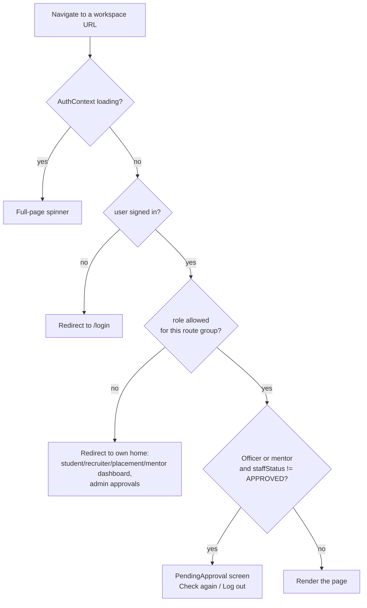
```mermaid
flowchart TD
    N[Navigate to a workspace URL] --> L{AuthContext loading?}
    L -- yes --> SP[Full-page spinner]
    L -- no --> U{user signed in?}
    U -- no --> LG[Redirect to /login]
    U -- yes --> R{role allowed<br/>for this route group?}
    R -- no --> HOME[Redirect to own home:<br/>student/recruiter/placement/mentor dashboard,<br/>admin approvals]
    R -- yes --> ST{Officer or mentor<br/>and staffStatus != APPROVED?}
    ST -- yes --> PA[PendingApproval screen<br/>Check again / Log out]
    ST -- no --> OUT[Render the page]
```

| URL prefix | Roles | Sidebar |
|---|---|---|
| `/student/*` | STUDENT | `STUDENT_NAV` |
| `/recruiter/*` | RECRUITER | `RECRUITER_NAV` |
| `/placement/*` | PLACEMENT_OFFICER, ADMIN | `PLACEMENT_NAV` (admins get `ADMIN_NAV`) |
| `/placement/team`, `/placement/mentoring*`, `/placement/learning` | PLACEMENT_OFFICER only | |
| `/admin/*` | ADMIN | `ADMIN_NAV` |
| `/mentor/*` | MENTOR | `MENTOR_NAV` |

On boot, `AuthContext` calls `GET /auth/me`; any failure clears the stored token. There's no global 401 handler: a token revoked mid-session produces per-request errors until the next reload.

---

## Permission matrix

Generated from the route files. ✓ = allowed by role; the **Scope** column says what the service then limits it to. S = Student, R = Recruiter, PO = Placement officer, M = Mentor, A = Admin. "Any" = any signed-in user.

### Accounts and colleges

| Endpoint | S | R | PO | M | A | Scope / rule |
|---|---|---|---|---|---|---|
| `POST /auth/register`, `/auth/login`, `/auth/forgot-password`, `/auth/reset-password` | public | | | | | IP rate-limited; admin role can't be chosen at sign-up |
| `GET /auth/me` | ✓ | ✓ | ✓ | ✓ | ✓ | self |
| `GET /colleges`, `/colleges/states`, `/colleges/:id` | public | | | | | directory search for sign-up |
| `GET /colleges/staff-requests`, `POST /colleges/staff-requests/:id/review` | | | ✓ | | ✓ | officer: own college, can't review self; admin: all (first officers) |
| `GET /colleges/mine/staff` | | | ✓ | ✓ | | own college |
| `GET /colleges/unverified`, `PATCH /colleges/:id`, `POST /colleges/:id/merge` | | | | | ✓ | platform |

### Students and profiles

| Endpoint | S | R | PO | M | A | Scope / rule |
|---|---|---|---|---|---|---|
| `GET/PUT /students/me`, skills, projects, certifications, resume upload | ✓ | | | | | self |
| `GET /students/me/skill-gaps`, `/readiness`, `/skill-passport` | ✓ | | | | | self; only jobs visible to own college |
| `GET /students`, `GET /students/:id` | | ✓ | ✓ | ✓ | ✓ | `studentsInScope`: recruiter = applicants only, staff = own college |
| `GET /students/:id/resume/file` | | ✓ | ✓ | ✓ | ✓ | recruiter only after the student applied to the company; staff own college |
| `GET /students/me/resume/file` | ✓ | | | | | own file |
| `GET/PUT /cv/me`, prefill, export, save-as-resume, suggest-summary | ✓ | | | | | self; export/AI rate-limited |

### Jobs, matching and applications

| Endpoint | S | R | PO | M | A | Scope / rule |
|---|---|---|---|---|---|---|
| `GET /companies`, `GET /companies/:id` | ✓ | ✓ | ✓ | ✓ | ✓ | not scoped (see gaps) |
| `POST /companies` | | ✓ | ✓ | | ✓ | recruiter: own company |
| `GET /jobs`, `GET /jobs/:id` | ✓ | ✓ | ✓ | ✓ | ✓ | recruiter: own company; others: `jobsVisibleToCollege`; students see PUBLISHED only in lists |
| `POST /jobs` | | ✓ | ✓ | | ✓ | officer jobs forced to own college only |
| `PUT /jobs/:id` (incl. auto-shortlist rule) | | ✓ | ✓ | | ✓ | recruiter: own company (403 otherwise); officer: only jobs targeted solely at own college |
| `POST /ai/jobs/analyze` (JD autofill) | | ✓ | ✓ | | ✓ | 20 per 10 min per user |
| `GET /matching/student/me/jobs` | ✓ | | | | | jobs visible to own college |
| `GET /matching/job/:jobId/candidates`, `POST /matching/job/:jobId` | | ✓ | ✓ | | ✓ | recruiter: own company's job (403); officer: job open to own college (404), only own students in the pool |
| `GET /predictive/jobs/:jobId/candidates`, `/predictive/model-info` | | ✓ | ✓ | | ✓ | same as matching |
| `POST /applications` | ✓ | | | | | job visible to own college and PUBLISHED; must pass eligibility; one per job |
| `GET /applications` | ✓ | ✓ | ✓ | ✓ | ✓ | `applicationsInScope` |
| `PATCH /applications/:id` (move stage) | | ✓ | ✓ | | ✓ | in scope; forward moves only, REJECTED/DECLINED from any non-final stage |

### Hiring workflow

| Endpoint | S | R | PO | M | A | Scope / rule |
|---|---|---|---|---|---|---|
| `GET /drives`, `/drives/:id`, `/drives/:id/conflicts` | | ✓ | ✓ | | ✓ | recruiter: own company's drives; officer: own college (404 otherwise) |
| `POST /drives`, `POST /drives/check` | | | ✓ | | ✓ | officer: own college; admin must name a college; job must be visible to it |
| `GET /interviews` | ✓ | ✓ | ✓ | ✓ | ✓ | via `applicationsInScope` |
| `POST /interviews`, `PATCH /interviews/:id` | | ✓ | ✓ | | ✓ | application in scope (403 otherwise); student and panel double-booking refused (409) |
| `GET /assignments`, `POST /assignments`, `GET/PATCH /assignments/:id`, `POST /assignments/:id/candidates`, `POST /assignments/submissions/:id/review` | | ✓ | | | | own company only (404 otherwise); candidates must have applied |
| `GET /assignments/mine`, `POST /assignments/submissions/:id/submit` | ✓ | | | | | own submissions; before the due date, while open and unreviewed |
| `GET /assignments/submissions/:id/file` | ✓ | ✓ | ✓ | | ✓ | owner, the company's recruiters, officer of the student's college (404 otherwise) |

### Offers and documents

| Endpoint | S | R | PO | M | A | Scope / rule |
|---|---|---|---|---|---|---|
| `GET /offers`, `GET /offers/:id` | ✓ | ✓ | ✓ | ✓ | ✓ | `offersInScope` / `assertOfferAccess` (403) |
| `POST /offers` | | ✓ | ✓ | | ✓ | application must be SELECTED and in scope |
| `PATCH /offers/:id` (joining), `/withdraw`, `/conversion` | | ✓ | ✓ | | ✓ | in scope; withdraw not after joining; conversion only for accepted internships |
| `POST /offers/:id/respond` | ✓ | | | | | own offer; from PENDING or DEFERRED; defer once |
| `POST /offers/:id/documents` (request), `/documents/:id/review` | | ✓ | ✓ | | ✓ | in scope; review only SUBMITTED documents |
| `POST /offers/:id/documents/:id/upload` | ✓ | ✓ | ✓ | ✓ | ✓ | in scope; students upload student-owned types, recruiters employer-owned types |
| `GET /offers/:id/documents/:id/file` | ✓ | ✓ | ✓ | ✓ | ✓ | in scope; streamed from private storage |
| `POST /offers/reminders/run` | | | ✓ | | ✓ | runs platform-wide (see gaps) |

### Practice, assessments and evidence

| Endpoint | S | R | PO | M | A | Scope / rule |
|---|---|---|---|---|---|---|
| `GET /coding/problems[/:id]`, `GET /sql/problems[/:id]` | ✓ | ✓ | ✓ | ✓ | ✓ | global; hidden tests and SQL solutions never returned |
| `POST /coding/problems`, `POST /sql/problems` | | | ✓ | | ✓ | global problem bank |
| `POST /coding/problems/:id/run|submit`, `POST /sql/problems/:id/run|submit` | ✓ | | | | | own submissions; passing records verified evidence |
| `GET /coding/submissions`, `GET /sql/submissions` | ✓ | ✓ | ✓ | ✓ | ✓ | student: own; others: all (see gaps) |
| `GET /assessments[/:id]` | ✓ | ✓ | ✓ | ✓ | ✓ | answer key and rubric never returned |
| `POST /assessments` | | | ✓ | | ✓ | MCQ or WRITTEN |
| `POST /assessments/:id/attempts`, `/attempts/:id/submit` | ✓ | | | | | own attempt |
| `GET /assessments/:id/attempts` | ✓ | ✓ | ✓ | ✓ | ✓ | student: own; others: all (see gaps) |
| `GET /mock-interviews/me` | ✓ | | | | | own |
| `GET /mock-interviews` | | | ✓ | ✓ | ✓ | own college (403 for another college's student) |
| `POST /mock-interviews` | | | ✓ | ✓ | | own college's students |

### Learning, mentoring, analytics, notifications

| Endpoint | S | R | PO | M | A | Scope / rule |
|---|---|---|---|---|---|---|
| `GET /learning/resources` | ✓ | | ✓ | ✓ | ✓ | shared items + own college's |
| `POST /learning/resources`, `DELETE /learning/resources/:id` | | | ✓ | ✓ | ✓ | staff add for their college, admin adds shared items; delete only own college's (admin any) |
| `PUT /learning/resources/:id/progress`, `GET /learning/me`, `/plan`, `POST /learning/tutor` | ✓ | | | | | self; tutor 20 per 10 min |
| `GET /learning/videos` | ✓ | | ✓ | ✓ | ✓ | 60 per 10 min |
| `GET /learning/students/:studentId` | | | ✓ | ✓ | ✓ | own college (403) |
| `GET /mentoring/me` | ✓ | | | | | own mentor |
| `GET /mentoring/mentors`, `/at-risk`, `POST/DELETE /mentoring/assignments`, `POST /mentoring/escalations` | | | ✓ | | | own college |
| `GET /mentoring/escalations`, `PATCH /mentoring/escalations/:id`, `GET /mentoring/mentees`, `/overview`, `/students/:id`, notes | | | ✓ | ✓ | | officer: own college; mentor: only assigned or escalated students (403 otherwise) |
| `GET /analytics/overview`, `/analytics/funnel` | ✓ | ✓ | ✓ | ✓ | ✓ | scoped counts; funnel refuses students |
| `GET /analytics/insights`, `POST /analytics/at-risk/:id/nudge` | | | ✓ | | ✓ | officer: own college; admin: platform |
| `POST /copilot/query` | | ✓ | ✓ | | ✓ | facts built from the caller's scope; 30 per 10 min |
| `GET /notifications`, unread count, mark read | ✓ | ✓ | ✓ | ✓ | ✓ | own notifications only |
| `GET /skills` | ✓ | ✓ | ✓ | ✓ | ✓ | global list |

---

## Feature flows

One diagram per feature area: who may start the action, which checks run, and what data they can reach.

### Sign-up, approval and login

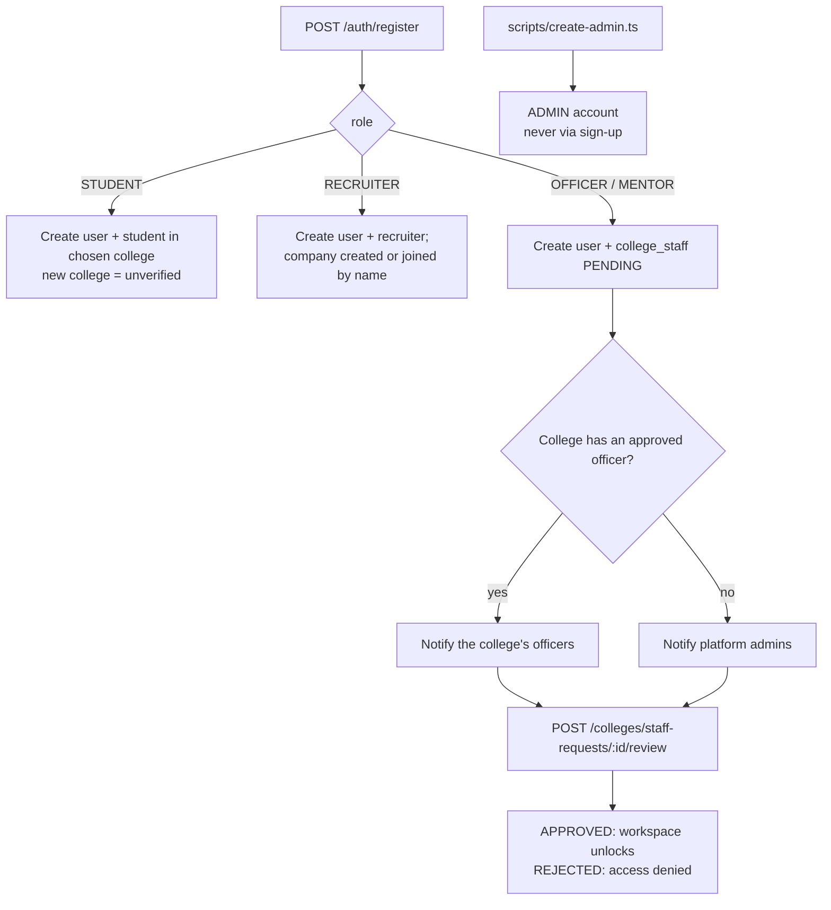
```mermaid
flowchart TD
    SU[POST /auth/register] --> RQ{role}
    RQ -- STUDENT --> ST[Create user + student in chosen college<br/>new college = unverified]
    RQ -- RECRUITER --> RC[Create user + recruiter;<br/>company created or joined by name]
    RQ -- OFFICER / MENTOR --> SF[Create user + college_staff PENDING]
    SF --> NT{College has an approved officer?}
    NT -- yes --> N1[Notify the college's officers]
    NT -- no --> N2[Notify platform admins]
    N1 & N2 --> RV[POST /colleges/staff-requests/:id/review]
    RV --> AP[APPROVED: workspace unlocks<br/>REJECTED: access denied]
    AD[scripts/create-admin.ts] --> ADM[ADMIN account<br/>never via sign-up]
```

### Job posting and visibility

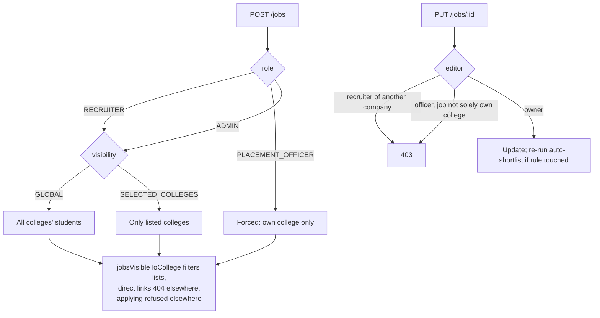
```mermaid
flowchart TD
    P[POST /jobs] --> R{role}
    R -- RECRUITER --> V{visibility}
    V -- GLOBAL --> G[All colleges' students]
    V -- SELECTED_COLLEGES --> S[Only listed colleges]
    R -- PLACEMENT_OFFICER --> O[Forced: own college only]
    R -- ADMIN --> V
    G & S & O --> VIS[jobsVisibleToCollege filters lists,<br/>direct links 404 elsewhere,<br/>applying refused elsewhere]
    E[PUT /jobs/:id] --> EO{editor}
    EO -- recruiter of another company --> F403[403]
    EO -- officer, job not solely own college --> F403
    EO -- owner --> OK[Update; re-run auto-shortlist if rule touched]
```

### Applying, eligibility and auto-shortlisting

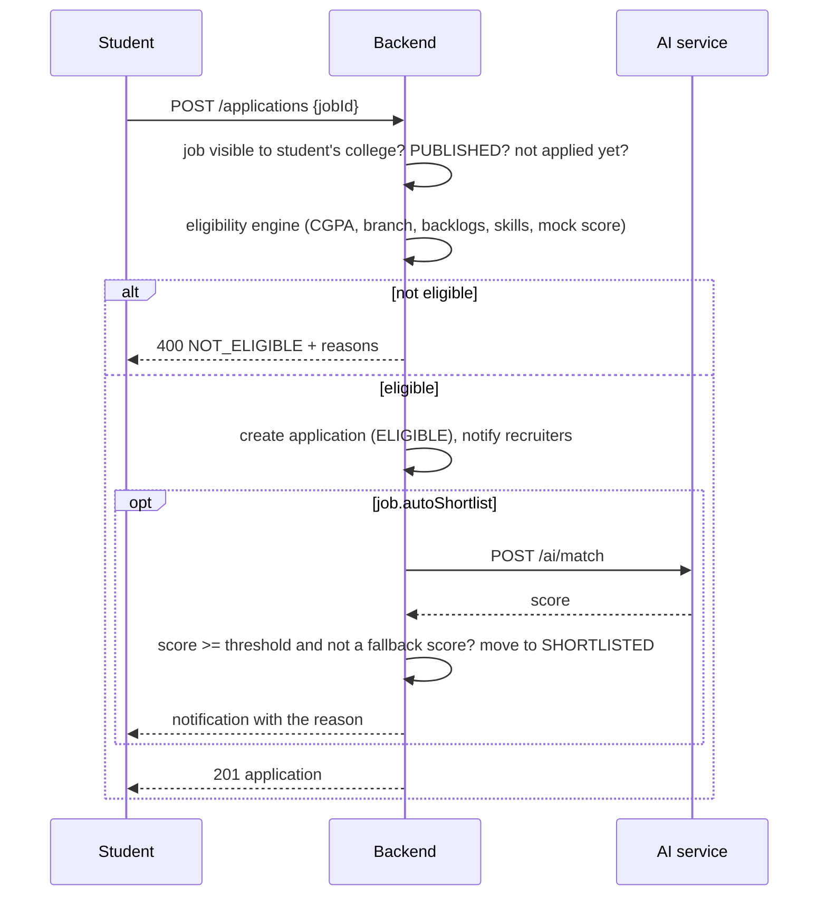
```mermaid
sequenceDiagram
    participant S as Student
    participant API as Backend
    participant AI as AI service
    S->>API: POST /applications {jobId}
    API->>API: job visible to student's college? PUBLISHED? not applied yet?
    API->>API: eligibility engine (CGPA, branch, backlogs, skills, mock score)
    alt not eligible
        API-->>S: 400 NOT_ELIGIBLE + reasons
    else eligible
        API->>API: create application (ELIGIBLE), notify recruiters
        opt job.autoShortlist
            API->>AI: POST /ai/match
            AI-->>API: score
            API->>API: score >= threshold and not a fallback score? move to SHORTLISTED
            API-->>S: notification with the reason
        end
        API-->>S: 201 application
    end
```

### Candidate ranking and pipeline

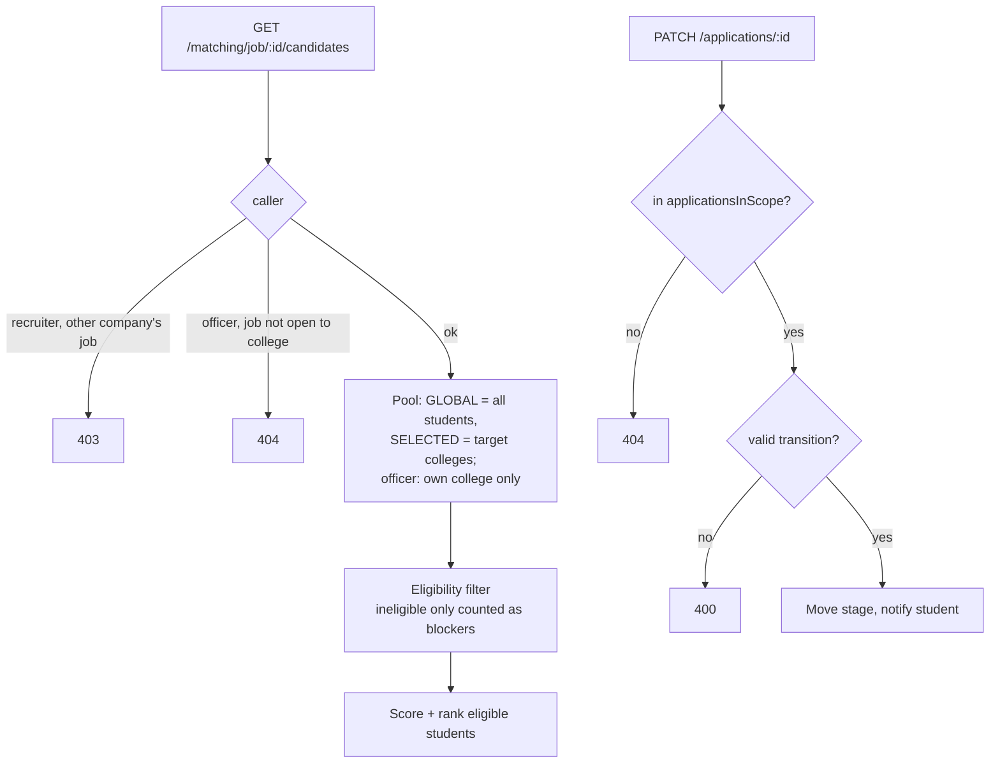
```mermaid
flowchart TD
    C[GET /matching/job/:id/candidates] --> W{caller}
    W -- recruiter, other company's job --> X403[403]
    W -- officer, job not open to college --> X404[404]
    W -- ok --> POOL[Pool: GLOBAL = all students,<br/>SELECTED = target colleges;<br/>officer: own college only]
    POOL --> EL[Eligibility filter<br/>ineligible only counted as blockers]
    EL --> RANK[Score + rank eligible students]
    PM[PATCH /applications/:id] --> SCP{in applicationsInScope?}
    SCP -- no --> N404[404]
    SCP -- yes --> TR{valid transition?}
    TR -- no --> B400[400]
    TR -- yes --> MV[Move stage, notify student]
```

### Interviews and drives

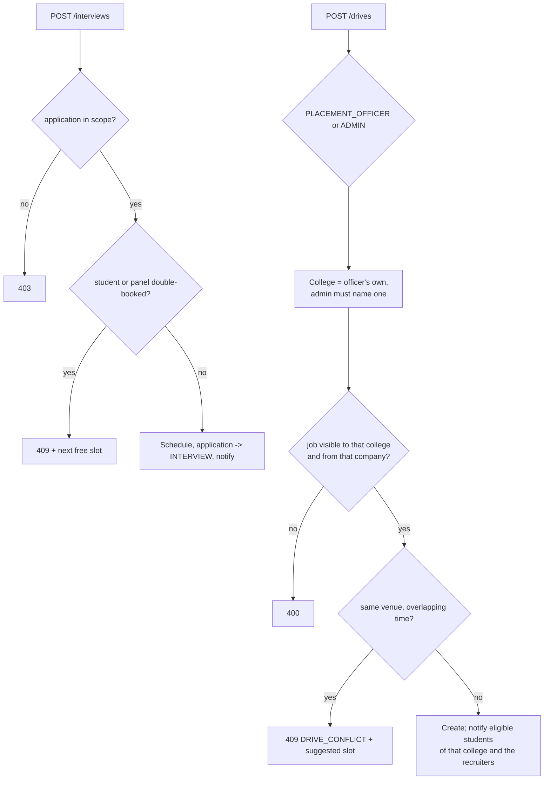
```mermaid
flowchart TD
    I[POST /interviews] --> IA{application in scope?}
    IA -- no --> I403[403]
    IA -- yes --> IC{student or panel double-booked?}
    IC -- yes --> I409[409 + next free slot]
    IC -- no --> IOK[Schedule, application -> INTERVIEW, notify]
    D[POST /drives] --> DR{PLACEMENT_OFFICER or ADMIN}
    DR --> DC[College = officer's own,<br/>admin must name one]
    DC --> DJ{job visible to that college<br/>and from that company?}
    DJ -- no --> D400[400]
    DJ -- yes --> DV{same venue, overlapping time?}
    DV -- yes --> D409[409 DRIVE_CONFLICT + suggested slot]
    DV -- no --> DOK[Create; notify eligible students<br/>of that college and the recruiters]
```

### Offers and joining documents

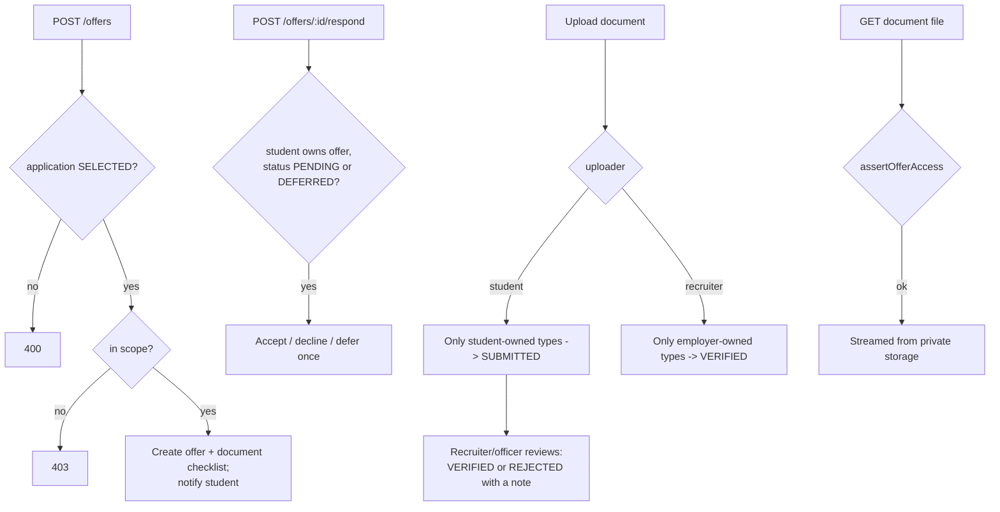
```mermaid
flowchart TD
    MO[POST /offers] --> SEL{application SELECTED?}
    SEL -- no --> O400[400]
    SEL -- yes --> OS{in scope?}
    OS -- no --> O403[403]
    OS -- yes --> CR[Create offer + document checklist;<br/>notify student]
    RSP[POST /offers/:id/respond] --> OWN{student owns offer,<br/>status PENDING or DEFERRED?}
    OWN -- yes --> ACC[Accept / decline / defer once]
    UP[Upload document] --> WHO{uploader}
    WHO -- student --> SD[Only student-owned types -> SUBMITTED]
    WHO -- recruiter --> ED[Only employer-owned types -> VERIFIED]
    SD --> REV[Recruiter/officer reviews:<br/>VERIFIED or REJECTED with a note]
    FILE[GET document file] --> FA{assertOfferAccess}
    FA -- ok --> STREAM[Streamed from private storage]
```

### Company assignments

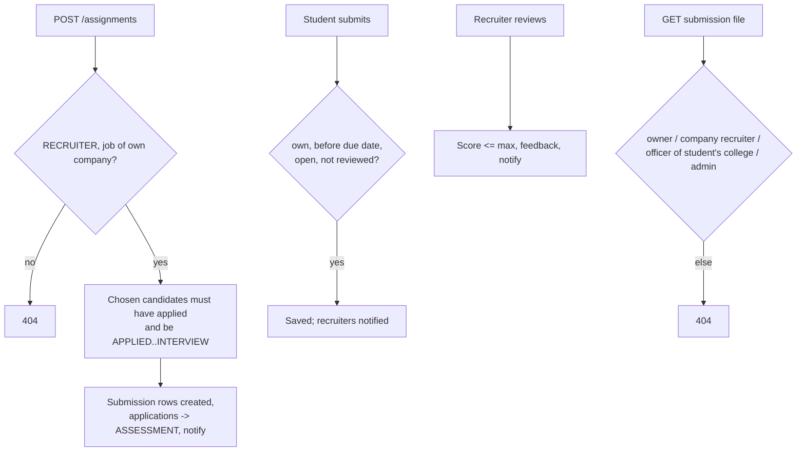
```mermaid
flowchart TD
    A[POST /assignments] --> AR{RECRUITER, job of own company?}
    AR -- no --> A404[404]
    AR -- yes --> AC[Chosen candidates must have applied<br/>and be APPLIED..INTERVIEW]
    AC --> AS[Submission rows created,<br/>applications -> ASSESSMENT, notify]
    SUB[Student submits] --> SC{own, before due date,<br/>open, not reviewed?}
    SC -- yes --> SV[Saved; recruiters notified]
    RV[Recruiter reviews] --> RS[Score <= max, feedback, notify]
    F[GET submission file] --> FA{owner / company recruiter /<br/>officer of student's college / admin}
    FA -- else --> F404[404]
```

### Mentoring and escalations

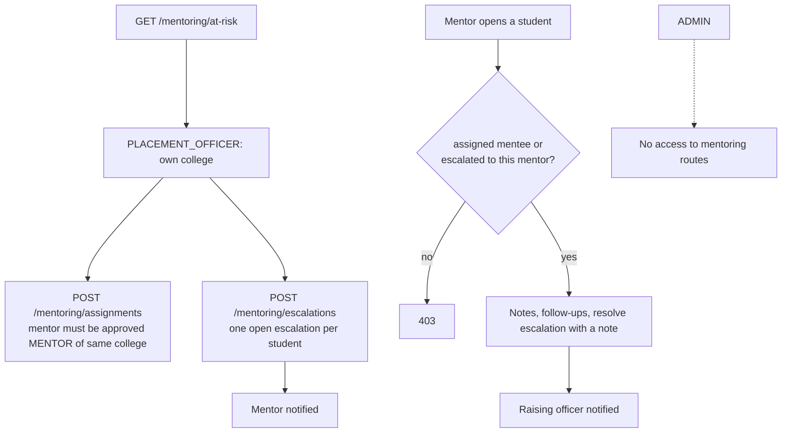
```mermaid
flowchart TD
    AR[GET /mentoring/at-risk] --> PO[PLACEMENT_OFFICER: own college]
    PO --> AS[POST /mentoring/assignments<br/>mentor must be approved MENTOR of same college]
    PO --> ES[POST /mentoring/escalations<br/>one open escalation per student]
    ES --> MN[Mentor notified]
    MV[Mentor opens a student] --> MA{assigned mentee or<br/>escalated to this mentor?}
    MA -- no --> M403[403]
    MA -- yes --> NOTE[Notes, follow-ups, resolve escalation with a note]
    NOTE --> BACK[Raising officer notified]
    ADM[ADMIN] -.-> NO[No access to mentoring routes]
```

### Mock interviews

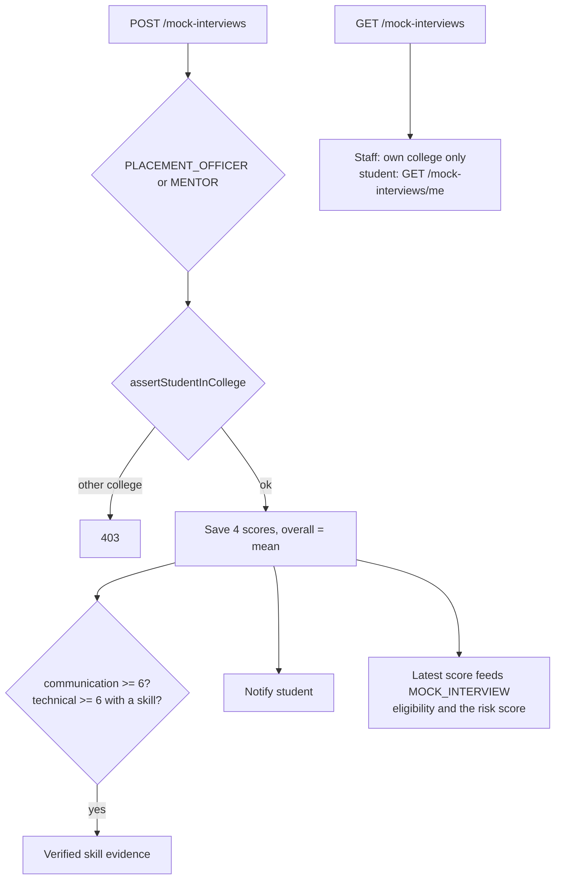
```mermaid
flowchart TD
    R[POST /mock-interviews] --> RR{PLACEMENT_OFFICER or MENTOR}
    RR --> SC{assertStudentInCollege}
    SC -- other college --> X403[403]
    SC -- ok --> SAVE[Save 4 scores, overall = mean]
    SAVE --> EV{communication >= 6?<br/>technical >= 6 with a skill?}
    EV -- yes --> VER[Verified skill evidence]
    SAVE --> N[Notify student]
    SAVE --> USE[Latest score feeds MOCK_INTERVIEW<br/>eligibility and the risk score]
    L[GET /mock-interviews] --> LS[Staff: own college only<br/>student: GET /mock-interviews/me]
```

### Practice labs and assessments

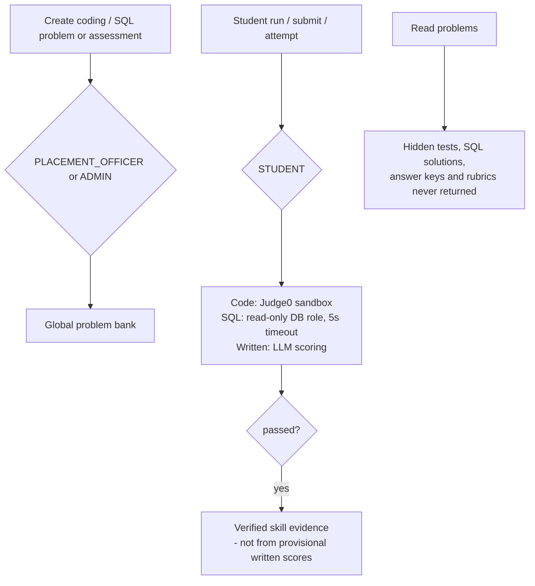
```mermaid
flowchart TD
    CP[Create coding / SQL problem or assessment] --> CR{PLACEMENT_OFFICER or ADMIN}
    CR --> BANK[Global problem bank]
    ST[Student run / submit / attempt] --> SR{STUDENT}
    SR --> CODE[Code: Judge0 sandbox<br/>SQL: read-only DB role, 5s timeout<br/>Written: LLM scoring]
    CODE --> PASS{passed?}
    PASS -- yes --> EVD[Verified skill evidence<br/>- not from provisional written scores]
    VIEW[Read problems] --> HID[Hidden tests, SQL solutions,<br/>answer keys and rubrics never returned]
```

### Learning library and AI tutor

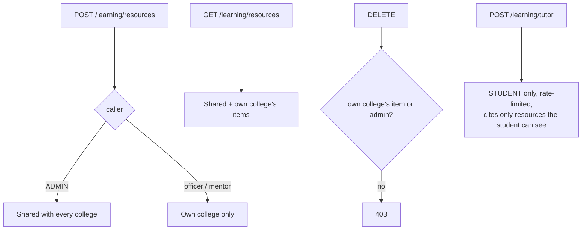
```mermaid
flowchart TD
    ADD[POST /learning/resources] --> WHO{caller}
    WHO -- ADMIN --> SH[Shared with every college]
    WHO -- officer / mentor --> OC[Own college only]
    LIST[GET /learning/resources] --> VIS[Shared + own college's items]
    DEL[DELETE] --> DO{own college's item or admin?}
    DO -- no --> D403[403]
    T[POST /learning/tutor] --> TS[STUDENT only, rate-limited;<br/>cites only resources the student can see]
```

### Analytics, Copilot and notifications

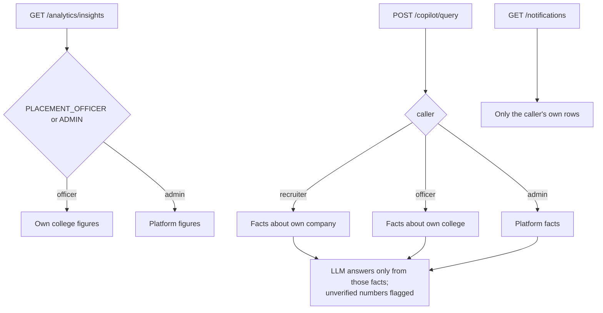
```mermaid
flowchart TD
    IN[GET /analytics/insights] --> IR{PLACEMENT_OFFICER or ADMIN}
    IR -- officer --> C1[Own college figures]
    IR -- admin --> C2[Platform figures]
    CO[POST /copilot/query] --> CS{caller}
    CS -- recruiter --> F1[Facts about own company]
    CS -- officer --> F2[Facts about own college]
    CS -- admin --> F3[Platform facts]
    F1 & F2 & F3 --> LLM[LLM answers only from those facts;<br/>unverified numbers flagged]
    NO[GET /notifications] --> OWN[Only the caller's own rows]
```

### Private files

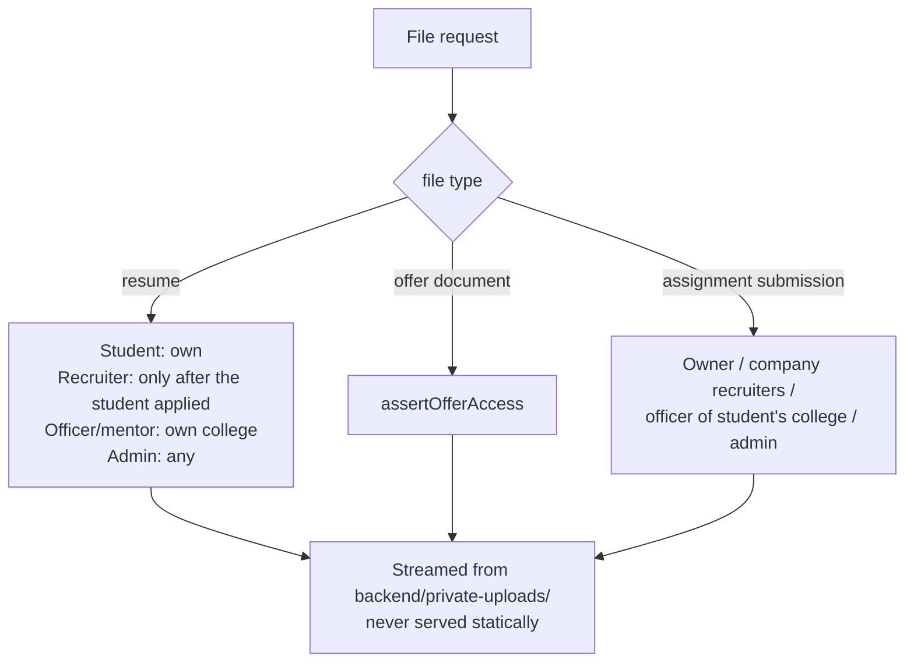
```mermaid
flowchart TD
    F[File request] --> T{file type}
    T -- resume --> RS[Student: own<br/>Recruiter: only after the student applied<br/>Officer/mentor: own college<br/>Admin: any]
    T -- offer document --> OD[assertOfferAccess]
    T -- assignment submission --> AS[Owner / company recruiters /<br/>officer of student's college / admin]
    RS & OD & AS --> STR[Streamed from backend/private-uploads/<br/>never served statically]
```

---

## Rate limits

In-memory, per API process (`middleware/rateLimit.ts`). Exceeding one returns 429 with `retryAfterSeconds`.

| Endpoint | Limit |
|---|---|
| `POST /auth/login` | 20 per 15 min per IP |
| `POST /auth/register`, `/auth/reset-password` | 10 per 15 min per IP |
| `POST /auth/forgot-password` | 10 per 15 min per IP and 3 per 15 min per email |
| `POST /ai/jobs/analyze` | 20 per 10 min per user |
| `POST /copilot/query` | 30 per 10 min per user |
| `GET /cv/me/export/:format` | 30 per 10 min per user |
| `POST /cv/me/save-as-resume` | 10 per 10 min per user |
| `POST /cv/me/suggest-summary` | 15 per 10 min per user |
| `GET /learning/videos` | 60 per 10 min per user |
| `POST /learning/tutor` | 20 per 10 min per user |

---

## Known gaps and inconsistencies

These are what the code does today, found while writing this document. They should be fixed before real student data is loaded.

| # | Gap | Where | Effect |
|---|---|---|---|
| 1 | Submission and attempt lists aren't scoped for non-students | `coding.service listSubmissions`, `sql-lab.service listSubmissions`, `assessments.service listAttempts` | Any recruiter, officer or mentor can list every student's code, queries and answers, across colleges |
| 2 | Company detail includes all its jobs | `companies.service getCompanyById` | Any signed-in user sees draft and college-restricted jobs of that company |
| 3 | Joining a company by name | `auth.service registerUser` (`company.upsert` by name) | Anyone who signs up as a recruiter with an existing company's name joins it |
| 4 | Students can change college | `students.service updateMyProfile` (`collegeName`) | A student can move themselves to another tenant |
| 5 | SQL-lab problem setup runs as the owner role | `sql-lab.service createProblem` | Officer-supplied schema/seed SQL runs with full privileges (student queries are safely sandboxed) |
| 6 | Reminders run platform-wide | `POST /offers/reminders/run` | An officer triggers reminders for every college (reminders are de-duplicated, so the harm is limited) |
| 7 | Interview panel clash check is cross-company | `interviews.service` | Two companies using the same panel name ("Panel A") block each other |
| 8 | Withdrawn offers can still be edited | `offers.service updateOffer` | Joining status can be set on a withdrawn offer |
| 9 | 403 vs 404 isn't consistent | offers, interviews, resume files, mock interviews, learning use 403; jobs, drives, assignments, mentoring use 404 | Some out-of-scope responses reveal that a record exists |
| 10 | Unused guards | `assertJobVisibleToCollege` is never called; `assertStudentInCollege` doesn't check students or recruiters; the `audit_logs` table is never written | No audit trail of staff actions |
| 11 | Per-process state | rate limits and the password-change cache | A multi-instance deployment needs a shared store |
| 12 | AI service has no authentication | `ai-service/app/main.py` (CORS `*`, no key) | Must run on a private network; anyone who can reach it can spend the Groq quota |
